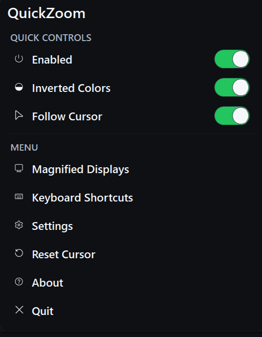
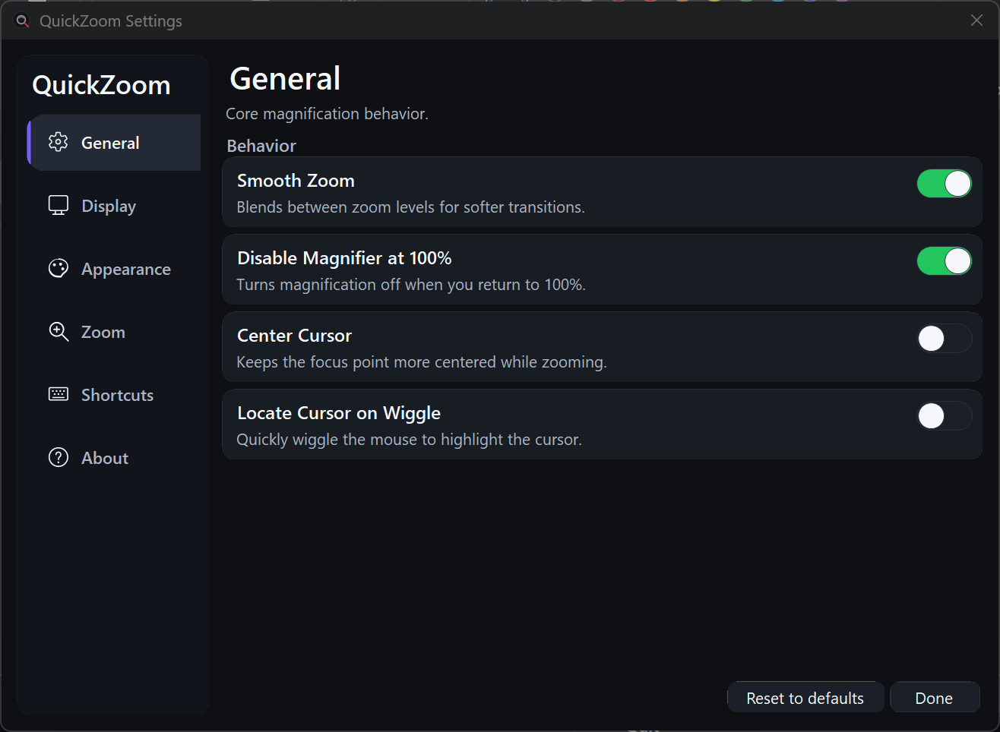

# QuickZoom

QuickZoom is a lightweight screen magnifier for Windows 10 and Windows 11 x64.

I built it because I am visually impaired myself and wanted something faster, simpler, and easier to use than Windows Magnifier. I also wanted a practical alternative to expensive software like SuperNova and ZoomText, without the extra bulk.

QuickZoom lives in the system tray, opens fast, and is built for everyday use when you need zoom right now, not after clicking through menus.

## Why this project exists

Windows Magnifier works, but it never felt quick enough or comfortable enough for the way I use a PC every day.

Paid solutions exist, but they can be expensive, heavy, and overkill if all you want is reliable magnification with simple controls.

QuickZoom was made to solve that:

- faster access to zoom
- simpler controls
- less clutter
- lighter than larger accessibility suites
- built for practical day-to-day desktop use

## Features

- Tray-based quick access
- Fast zoom with keyboard and mouse shortcuts
- Inverted colors mode
- Follow cursor support
- Smooth zooming
- Auto-disable at 100%
- Optional center-cursor behavior
- Cursor locate on wiggle
- Multi-monitor support
- Per-monitor display selection
- Dark, light, or system theme
- English and Danish UI
- Optional elevated startup support for better compatibility with elevated apps

## How to use

By default:

### Zoom
- Hold `Alt` and scroll the mouse wheel
- Hold `Alt` and press `+` or `-`

### Invert colors
- Hold `Alt` and click the middle mouse button
- Or press `Alt + I`

QuickZoom is designed to stay out of the way until you need it.

## Settings

QuickZoom includes a settings window for the main options, including:

- zoom step
- maximum zoom level
- refresh rate
- display mode
- theme
- language
- enable key
- invert hotkey
- follow cursor
- smooth zoom
- center cursor
- wiggle-to-locate cursor

## Multi-monitor support

QuickZoom works with single and multi-monitor setups.

You can choose to:
- magnify all displays
- follow the monitor under the cursor
- select specific display(s)

## Elevated app support

QuickZoom includes an optional startup service setup that can improve compatibility with elevated applications.

This setup can:
- install QuickZoom to a managed location
- register an elevated startup task
- reduce repeated UAC prompts after one-time setup

## Supported platforms

- Windows 10 x64
- Windows 11 x64

## Requirements

- .NET 8 Desktop Runtime or later  
  or
- a self-contained published build

## Screenshots

### Tray Menu



### Settings Window



## Build from source

```powershell
dotnet build .\QuickZoom.csproj -c Release
```

## Publish self-contained

```powershell
dotnet publish .\QuickZoom.csproj -c Release -r win-x64 --self-contained true -p:PublishSingleFile=true -p:IncludeNativeLibrariesForSelfExtract=true -p:PublishTrimmed=false -o .\Build76
```

## Project goal

QuickZoom is meant to be a practical accessibility tool for people who want:

- quick temporary magnification
- a simpler alternative to Windows Magnifier
- a lightweight tray-first workflow
- something less bulky than commercial accessibility suites

## Notes

This repository currently does not include a formal `LICENSE` file.

Until a license is added, the code should not be treated as fully open-source for reuse or redistribution.

## Status

QuickZoom is an actively developed Windows utility focused on accessibility, speed, and a cleaner user experience.
