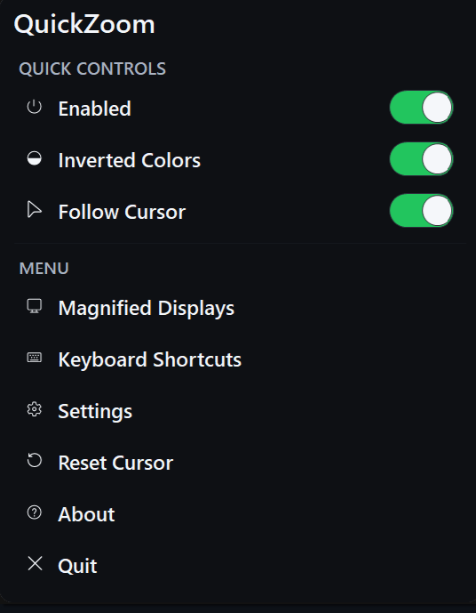
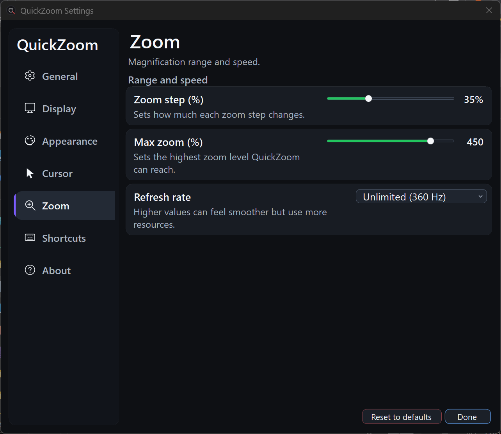

# QuickZoom

<p align="center">
  
</p>

<h3 align="center">Lightweight screen magnification for Windows 10 and 11</h3>

<p align="center">
  QuickZoom is a fast, tray-based accessibility tool built on the native Windows magnification engine.
</p>

<p align="center">
  <a href="https://github.com/BagerRyg/QuickZoom/releases">
    
  </a>
  
  
  
</p>

<p align="center">
  <a href="https://dev.ryg.dk/quickzoom/">Website</a> |
  <a href="https://github.com/BagerRyg/QuickZoom/releases">Download</a> |
  <a href="#features">Features</a> |
  <a href="#shortcuts">Shortcuts</a> |
  <a href="#build-from-source">Build from source</a>
</p>

---

## About

QuickZoom is a lightweight magnification and accessibility tool for Windows 10 and Windows 11.

It was built to extend and improve the native Windows magnification experience with faster access, better tray controls, smoother everyday use, and practical multi-monitor support. The goal is simple: make zooming the desktop feel quick, reliable, and easy to adjust.

QuickZoom is also a free and open-source alternative for users who do not need a large paid accessibility suite. Tools such as ZoomText and SuperNova can be powerful, but they can also be expensive, resource-heavy, and more complex than some users need. QuickZoom focuses on the core magnification features that matter most during normal PC use.

## Why QuickZoom?

QuickZoom is designed for users who want:

- Fast zoom control without opening a large application window.
- A simple tray menu with the most important actions one click away.
- A full settings window for deeper configuration.
- Smooth magnification using the native Windows magnification engine.
- Reliable multi-monitor magnification.
- A portable, self-contained app that can also start automatically with Windows.
- A free, open-source accessibility tool that is easy to inspect, modify, and improve.

## Features

- Tray-based quick controls.
- Full settings window for advanced configuration.
- Mouse and keyboard zoom shortcuts.
- Smooth zoom transitions.
- Follow-cursor magnification.
- Optional center-cursor behavior.
- Auto-disable at 100% zoom.
- Inverted colors mode.
- Cursor enhancement and wiggle-to-locate support.
- Single-display and multi-display magnification modes.
- Magnification across all active displays.
- Per-monitor display selection.
- Dark, light, and system theme support.
- English and Danish interface.
- Optional elevated startup support for better compatibility with administrator apps.
- Portable self-contained release builds.

## Multi-monitor support

QuickZoom supports magnification on multiple displays.

The most reliable and smoothest mode is magnification across all active displays. This mode is recommended for most multi-monitor setups because it avoids many of the edge cases that can happen when only one selected monitor is magnified.

Per-monitor selection is also available for users who need a more specific setup.

## Protected video playback

Because QuickZoom uses the native Windows magnification engine, it can often magnify protected video playback surfaces such as TV players, streaming services, and DRM-protected browser video.

This can work better than some third-party magnification tools in certain setups, but behavior can still depend on the app, browser, GPU driver, hardware acceleration, and the type of protected content being played.

## Portable or automatic startup

QuickZoom can be run as a portable self-contained app.

No full installation is required for normal use. Download the release, run the executable, and QuickZoom starts in the system tray.

QuickZoom can also be configured to start automatically with Windows. This requires approving a single UAC prompt during setup because Windows needs permission to register the built-in elevated startup support.

## Shortcuts

These are the default shortcuts. They can be changed in Settings.

| Action | Shortcut |
| --- | --- |
| Zoom with mouse | `Alt` + mouse wheel |
| Zoom with keyboard | `Alt` + `+` / `-` |
| Invert colors with mouse | `Alt` + middle mouse button |
| Invert colors with keyboard | `Alt` + `I` |

## Screenshots

### Tray menu



### Settings window



## Requirements

- Windows 10 x64 or Windows 11 x64.
- .NET 10 Desktop Runtime, unless you use the self-contained release build.

## Download

Download the latest release from the [GitHub releases page](https://github.com/BagerRyg/QuickZoom/releases).

The published release is intended for Windows x64.

## Build from source

Clone the repository and build the project in Release mode:

```powershell
git clone https://github.com/BagerRyg/QuickZoom.git
cd QuickZoom
dotnet build .\QuickZoom.csproj -c Release
```

Create a self-contained Windows x64 build:

```powershell
dotnet publish .\QuickZoom.csproj -c Release -r win-x64 --self-contained true -p:PublishSingleFile=true -p:IncludeNativeLibrariesForSelfExtract=true -p:PublishTrimmed=false -p:DebugType=None -o ".\Build 1"
```

## Elevated startup support

QuickZoom can optionally install a managed startup copy and register elevated startup support. This helps QuickZoom work more consistently with applications that run as administrator.

This setup is optional. QuickZoom can also run directly without registering startup support.

## Project status

QuickZoom is actively developed as a focused Windows accessibility utility.

The project aims to stay lightweight, practical, and easy to use instead of becoming a large all-in-one accessibility suite.

## Limitations

QuickZoom relies on Windows' native magnification functionality, so some behavior can depend on Windows, GPU drivers, display scaling, and the application being magnified.

Fullscreen games, anti-cheat software, protected windows, and some video playback surfaces may behave differently depending on the system.

## License

QuickZoom is licensed under the GNU General Public License v3.0.

See [LICENSE](LICENSE) for the full license text.
